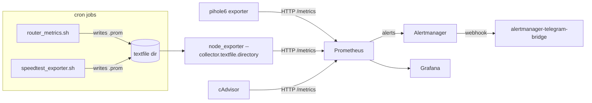

# Homelab Observability

A small collection of Prometheus textfile-collector exporters, alerting
rules, and an incident postmortem from running Prometheus + Grafana on a
Raspberry Pi 5 homelab. Shared here because the problems solved are generic
SRE problems that show up at any scale: monitoring a device with no native
exporter, surviving an upstream API breaking change, getting cron-based
jobs to actually run with the right permissions, and alerting on both
host-level and container-level health.

## What's here

```
exporters/
  router-textfile/    Monitor a consumer router (temp, memory, per-core CPU)
                       over SSH, exposed via node_exporter's textfile collector
  speedtest-textfile/ Periodic speedtest -> Prometheus metric, with the
                       cron/permissions gotchas documented
  pihole6/            Notes + minimal exporter for Pi-hole v6's new
                       session-based API (v5 exporters broke on upgrade)

alerting/
  alerts.yml           Prometheus alerting rules: host-level health
                       (CPU/memory/disk/temp/key services) and per-container
                       health via cAdvisor metrics
  cadvisor-alerts.yml  Production cAdvisor alert rules (CPU throttling,
                       memory limits, OOM kills, network errors, disk) —
                       a filled-in version of the per-container examples
                       above, running against a real Pi 5 + k3s workload

docs/postmortems/
  2026-06-02-pihole-v6-exporter-outage.md
                       Blameless postmortem: Pi-hole v5 -> v6 upgrade
                       silently broke the Prometheus exporter; timeline,
                       root cause, fix, and follow-ups.

grafana/
  dashboards/
    homelab-observability.json   Exported Grafana dashboard JSON for the above
    cadvisor-dashboard.json      Full cAdvisor dashboard: CPU/mem/net/blkio
                                  per container, top-N tables, throttling
```

## Why "textfile collector" exporters?

`node_exporter`'s [textfile
collector](https://github.com/prometheus/node_exporter#textfile-collector)
is the simplest possible way to get arbitrary metrics into Prometheus: any
script that can write a `.prom` file on a cron schedule becomes an
exporter. No need to run a long-lived HTTP server for every little metric
source. The two scripts under `exporters/` follow this pattern — they're
deliberately boring, which is the point.



## Alerting

`alerting/alerts.yml` has two rule groups:

- **homelab** — host-level health: `NodeDown`, `HighCPU` (>85%, 5m), `HighMemory` (>85%, 5m), `DiskSpaceLow` (>80%, 5m), `HighTemperature` (>70°C, 2m), `PiholeDown`, `PrometheusDown`
- **containers** — per-container health via [cAdvisor](https://github.com/google/cadvisor) metrics: `ContainerDown` (no metrics reported for 60s+), `ContainerHighMemory` (>300MB, 5m), `ContainerRestarting`

Container names in the example rules are placeholders — swap them for your own. Pair this with [alertmanager-telegram-bridge](https://github.com/bibigon14/alertmanager-telegram-bridge) to get these delivered to Telegram with quiet hours, throttling, and label-based routing.

`alerting/cadvisor-alerts.yml` is the production version of the container rules above — 9 alerts covering CPU throttling, memory-limit pressure, OOM kills, frequent restarts, filesystem usage (container and host), network errors, and a watchdog on the cAdvisor scrape target itself.

To test the full alert lifecycle end-to-end: stop a monitored container, wait for `ContainerDown` to go from pending to firing (~70s with the rules above), confirm the Telegram alert arrives, restart the container, and confirm the resolved notification arrives after Alertmanager's `resolve_timeout`.

## Setup

1. Enable the textfile collector on `node_exporter`:

   ```
   ARGS="--collector.textfile.directory=/var/lib/prometheus/node-exporter"
   ```

2. Drop the scripts from `exporters/*/` into `/usr/local/bin/`, fill in
   the environment variables at the top of each (router IP, SSH key path,
   etc — see each script's header comment), and schedule them via cron.

3. For Pi-hole, see `exporters/pihole6/README.md` — and read the
   postmortem first if you're migrating from Pi-hole v5.

4. Deploy [cAdvisor](https://github.com/google/cadvisor) (`docker run gcr.io/cadvisor/cadvisor:latest`) and add it as a Prometheus scrape target if you want container-level alerting.

5. Copy `alerting/alerts.yml` (and `alerting/cadvisor-alerts.yml` for the production container rules) to your Prometheus rules directory (e.g. `/etc/prometheus/rules/`), reference them in `prometheus.yml`'s `rule_files`, and reload Prometheus.

6. Import dashboards from `grafana/dashboards/` into Grafana, pointing at
   your Prometheus datasource.

## License

MIT.
