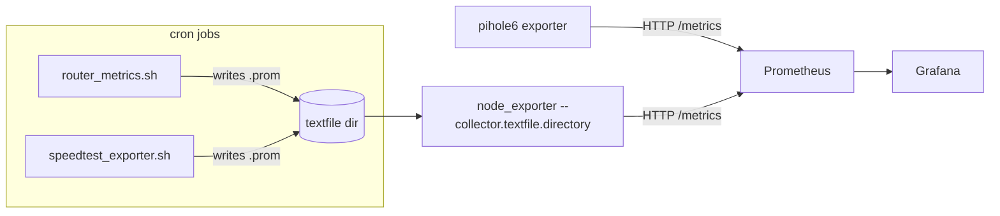

# Homelab Observability

A small collection of Prometheus textfile-collector exporters and an
incident postmortem from running Prometheus + Grafana on a Raspberry Pi 5
homelab. Shared here because the problems solved are generic SRE problems
that show up at any scale: monitoring a device with no native exporter,
surviving an upstream API breaking change, and getting cron-based jobs to
actually run with the right permissions.

## What's here

```
exporters/
  router-textfile/    Monitor a consumer router (temp, memory, per-core CPU)
                       over SSH, exposed via node_exporter's textfile collector
  speedtest-textfile/ Periodic speedtest -> Prometheus metric, with the
                       cron/permissions gotchas documented
  pihole6/            Notes + minimal exporter for Pi-hole v6's new
                       session-based API (v5 exporters broke on upgrade)

docs/postmortems/
  2026-06-02-pihole-v6-exporter-outage.md
                       Blameless postmortem: Pi-hole v5 -> v6 upgrade
                       silently broke the Prometheus exporter; timeline,
                       root cause, fix, and follow-ups.

grafana/
  dashboards/          Exported Grafana dashboard JSON for the above
```

## Why "textfile collector" exporters?

`node_exporter`'s [textfile
collector](https://github.com/prometheus/node_exporter#textfile-collector)
is the simplest possible way to get arbitrary metrics into Prometheus: any
script that can write a `.prom` file on a cron schedule becomes an
exporter. No need to run a long-lived HTTP server for every little metric
source. The two scripts under `exporters/` follow this pattern — they're
deliberately boring, which is the point.



## Setup

1. Enable the textfile collector on `node_exporter`:

   ```
   ARGS="--collector.textfile.directory=/var/lib/prometheus/node-exporter"
   ```

2. Drop the scripts from `exporters/*/` into `/usr/local/bin/`, fill in
   the environment variables at the top of each (router IP, SSH key path,
   etc — see each script's header comment), and schedule them via cron.

3. For Pi-hole, see `exporters/pihole6/README.md` — and read the
   postmortem first if you're migrating from Pi-hole v5.

4. Import dashboards from `grafana/dashboards/` into Grafana, pointing at
   your Prometheus datasource.

## License

MIT.
