# Homelab Observability

A small collection of Prometheus textfile-collector exporters, alerting
rules, and an incident postmortem from running Prometheus + Grafana on a
Raspberry Pi 5 homelab. Shared here because the problems solved are generic
SRE problems that show up at any scale: monitoring a device with no native
exporter, surviving an upstream API breaking change, getting cron-based
jobs to actually run with the right permissions, and alerting on host,
container, Kubernetes-object, external-probe, and GitOps-sync health.

## What's here

```
exporters/
  router-textfile/    Monitor a consumer router (temp, memory, per-core CPU)
                       over SSH, exposed via node_exporter's textfile collector
  speedtest-textfile/ Periodic speedtest -> Prometheus metric, with the
                       cron/permissions gotchas documented
  pihole6/            Notes + minimal exporter for Pi-hole v6's new
                       session-based API (v5 exporters broke on upgrade)
  blackbox/            blackbox_exporter config + systemd unit: HTTP/TLS
                       probing of every *.homelab.local service from the
                       outside in, including TLS cert expiry tracking

alerting/
  alerts.yml            Prometheus alerting rules: host-level health
                        (CPU/memory/disk/temp/key services) and per-container
                        health via cAdvisor metrics
  cadvisor-alerts.yml   Production cAdvisor alert rules (CPU throttling,
                        memory limits, OOM kills, network errors, disk) —
                        a filled-in version of the per-container examples
                        above, running against a real Pi 5 + k3s workload
  k3s-alerts.yml        Kubernetes-object-level alert rules via
                        kube-state-metrics: Pod crash loops, Job/CronJob
                        failures, Deployment/StatefulSet replica mismatches,
                        PVC capacity — the layer cAdvisor can't see, since
                        cAdvisor only knows about cgroups, not k8s objects
  blackbox-alerts.yml   External HTTP/TLS probe alerts: service down,
                        slow response, TLS cert expiring (30-day warning,
                        7-day critical escalation)
  argocd-alerts.yml     GitOps sync/health alerts: OutOfSync, Degraded,
                        Missing resources, stuck Progressing — catches
                        drift between git and cluster state, and failed
                        or stalled deployments

docs/postmortems/
  2026-06-02-pihole-v6-exporter-outage.md
                       Blameless postmortem: Pi-hole v5 -> v6 upgrade
                       silently broke the Prometheus exporter; timeline,
                       root cause, fix, and follow-ups.

grafana/
  dashboards/
    homelab-observability.json   Exported Grafana dashboard JSON for the above
    cadvisor-dashboard.json      cAdvisor: CPU/mem/net/blkio per container,
                                  OOM events, CPU pressure stall (PSI)
    loki-dashboard.json          Loki logs: volume by level, error rate,
                                  top pods, filterable live log viewer
    iptv-monitor.json            IPTV server health: mtr latency, jitter,
                                  download speeds, server switching history
    node-exporter-full.json      Node Exporter: full host metrics (CPU, RAM,
                                  disk, network, temperature, systemd)
    router-asus-rt-be88u.json    Router: CPU/temp/memory/connected clients
    pihole-monitor.json          Pi-hole: queries, blocked %, top domains
    homebridge-monitor.json      Homebridge: device status, plugin health
    telegram-bots.json           Telegram bots: API latency, message rates

docs/
  screenshots/                   Dashboard screenshots for portfolio/README
```

## Why "textfile collector" exporters?

`node_exporter`'s [textfile
collector](https://github.com/prometheus/node_exporter#textfile-collector)
is the simplest possible way to get arbitrary metrics into Prometheus: any
script that can write a `.prom` file on a cron schedule becomes an
exporter. No need to run a long-lived HTTP server for every little metric
source. The two scripts under `exporters/` follow this pattern — they're
deliberately boring, which is the point.

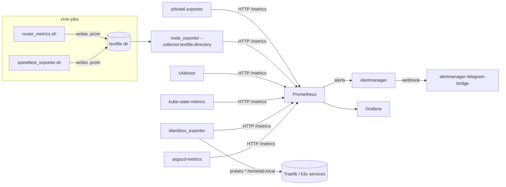

## Alerting

Five layers, each covering what the layer below it can't see:

- **Host** (`alerting/alerts.yml`, group `homelab`) — `NodeDown`, `HighCPU` (>85%, 5m), `HighMemory` (>85%, 5m), `DiskSpaceLow` (>80%, 5m), `HighTemperature` (>70°C, 2m), `PiholeDown`, `PrometheusDown`
- **Container** (`alerting/alerts.yml` group `containers`, plus the production `alerting/cadvisor-alerts.yml`) — per-container CPU/memory/throttling/OOM/network/filesystem via [cAdvisor](https://github.com/google/cadvisor). cAdvisor sees cgroups — actual resource consumption — but has no concept of a Kubernetes Pod, Deployment, or CronJob.
- **Kubernetes object** (`alerting/k3s-alerts.yml`) — Pod crash loops, Pods stuck Pending/Unknown/Failed, Deployment/StatefulSet replica mismatches, **Job/CronJob failures**, PVC capacity, via [kube-state-metrics](https://github.com/kubernetes/kube-state-metrics). This is the layer that catches "the CronJob's pod exited 0/1 with BackoffLimitExceeded" — something no amount of cgroup-level CPU/memory monitoring will ever surface, because the container can be perfectly healthy resource-wise and still be crashing on a bad env var or bug.
- **External probe** (`alerting/blackbox-alerts.yml`) — HTTP/TLS checks against every `*.homelab.local` URL from the outside, via [blackbox_exporter](https://github.com/prometheus/blackbox_exporter). Catches what none of the above can: Traefik routing misconfigurations, DNS issues, and TLS certificates approaching expiry (30-day warning, 7-day critical) — all things that can break access to a perfectly healthy backend.
- **GitOps sync** (`alerting/argocd-alerts.yml`) — ArgoCD application sync and health status via its built-in `argocd-metrics` endpoint. Catches drift between what's in git and what's actually running (`OutOfSync`), deployments that are broken (`Degraded`), resources that vanished (`Missing`), and syncs that never finish (`Progressing` for 30+ minutes). None of the layers above know or care whether the cluster state matches the source of truth in git — this is the only layer that does.

Container names in the example rules in `alerts.yml` are placeholders — swap them for your own. Pair all of this with [alertmanager-telegram-bridge](https://github.com/bibigon14/alertmanager-telegram-bridge) to get alerts delivered to Telegram with quiet hours, throttling, and label-based routing.

`alerting/cadvisor-alerts.yml` is the production version of the container rules above — 9 alerts covering CPU throttling, memory-limit pressure, OOM kills, frequent restarts, filesystem usage (container and host), network errors, and a watchdog on the cAdvisor scrape target itself.

`alerting/k3s-alerts.yml` is 8 rules scoped to a single namespace (swap `homelab` for your own), including a watchdog on the kube-state-metrics scrape target itself. `KubeJobFailed` is the one that actually catches application bugs — e.g. an env var collision with a Kubernetes auto-injected `<SERVICE>_PORT` variable causing a CronJob to crash on every run with no resource-level symptom at all.

`alerting/blackbox-alerts.yml` is 5 rules: service-down, slow-response, two TLS-expiry thresholds (escalating from warning to critical), and a watchdog on blackbox_exporter itself. Since the homelab uses a self-signed CA for `*.homelab.local`, the blackbox module sets `insecure_skip_verify: true` — the goal is "is the service up and is the cert close to expiring," not full chain-of-trust validation.

`alerting/argocd-alerts.yml` is 5 rules built on `argocd_app_info`'s `sync_status`/`health_status` labels, plus a watchdog on the argocd-metrics scrape target itself. Since Prometheus runs on the host rather than in-cluster, `argocd-metrics` (ClusterIP by default) needs to be exposed via NodePort the same way as kube-state-metrics.

To test the full alert lifecycle end-to-end: stop a monitored container, wait for `ContainerDown` to go from pending to firing (~70s with the rules above), confirm the Telegram alert arrives, restart the container, and confirm the resolved notification arrives after Alertmanager's `resolve_timeout`.

## Dashboards

All dashboards are exported to `grafana/dashboards/` and can be imported via the Grafana API or UI. Nine dashboards covering host, container, Kubernetes, logs, networking, and application metrics:

### Node Exporter — Host Metrics
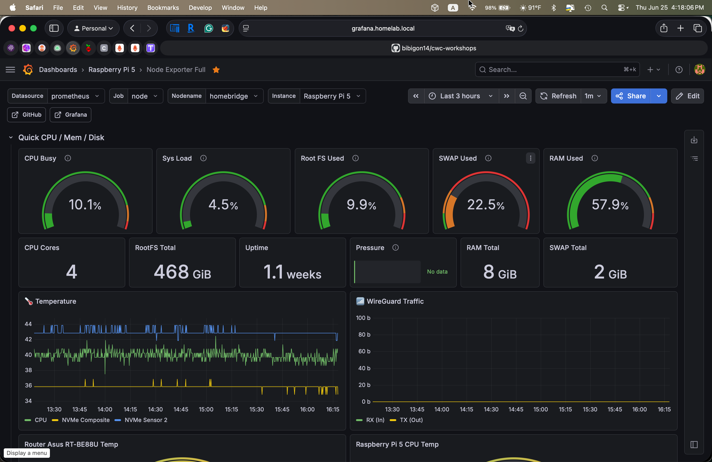
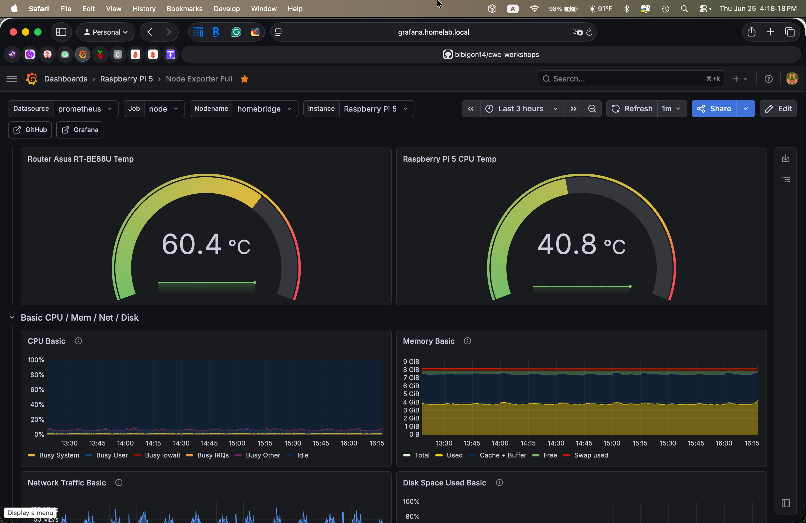

### cAdvisor — Container Deep Dive
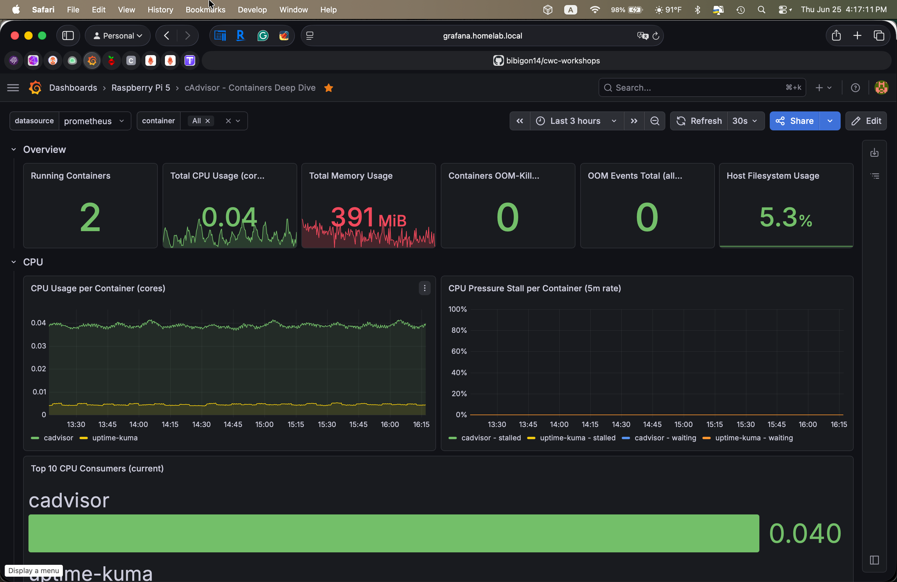

### Loki — Centralized Logs
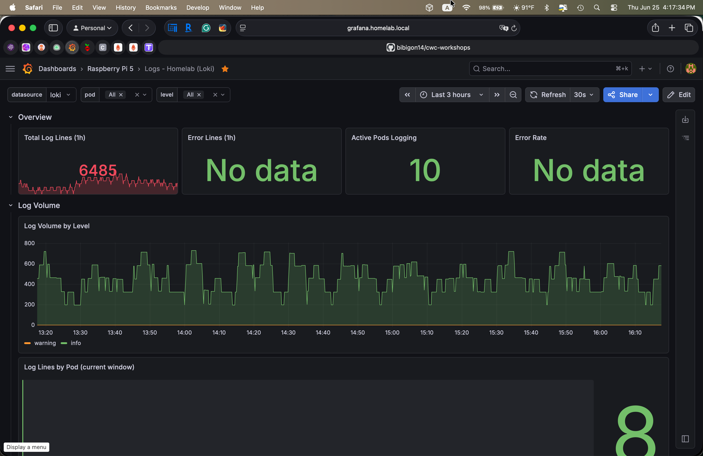
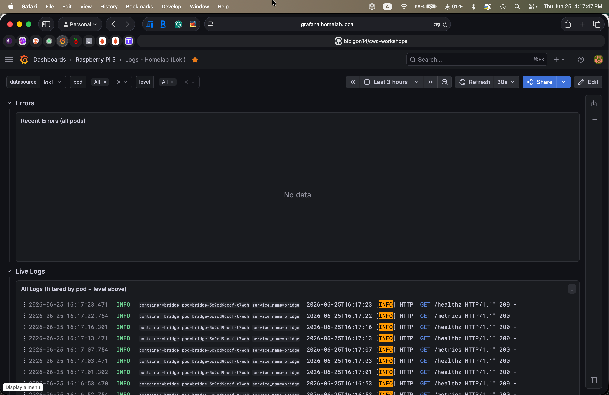

### IPTV Monitor
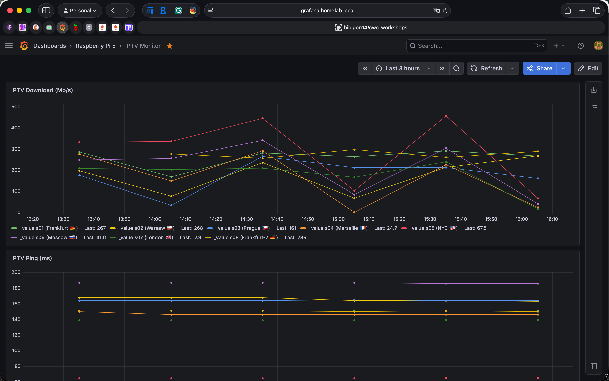
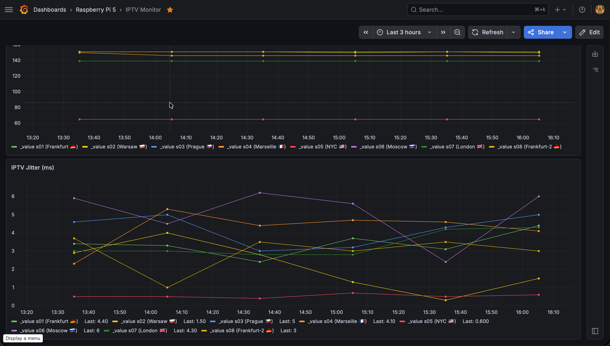

### Pi-hole Monitor
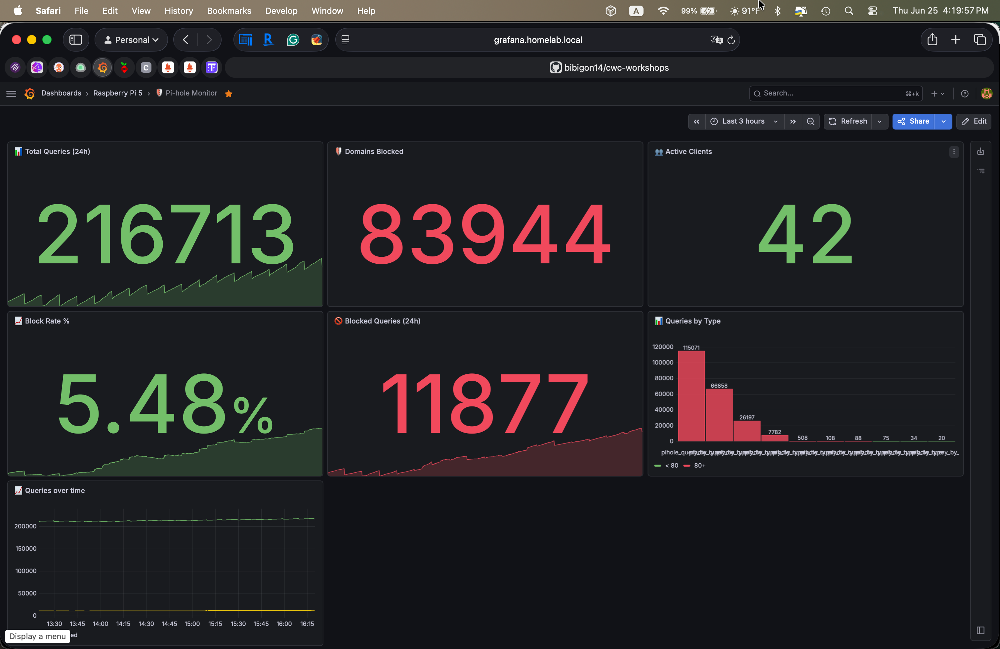

### Router Asus RT-BE88U
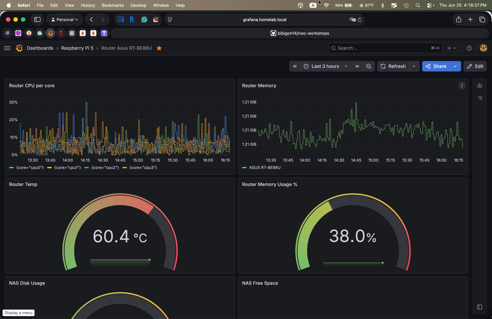

### Telegram Bots
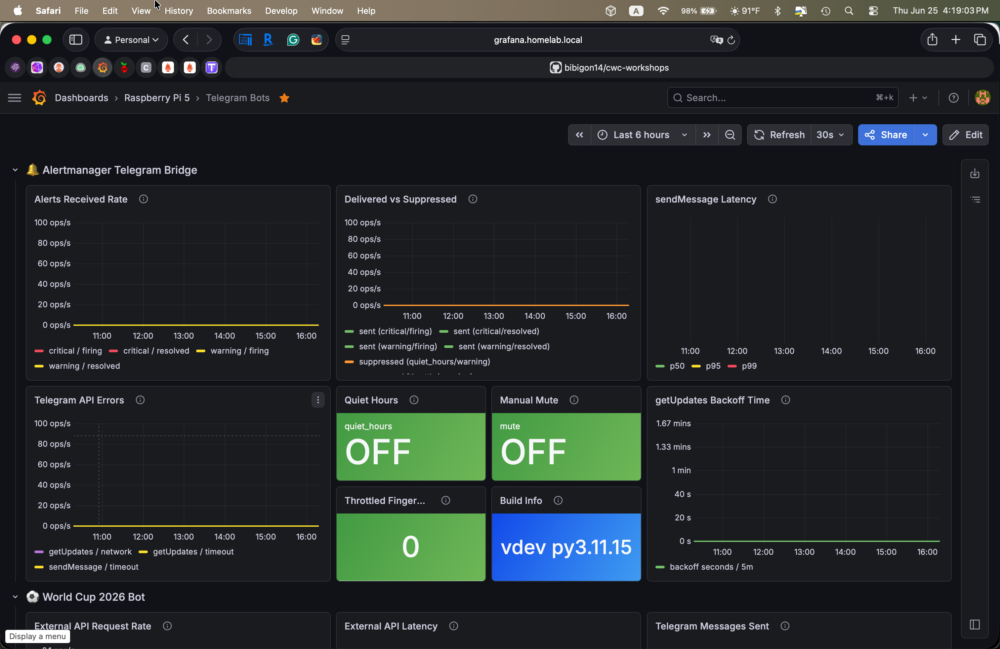
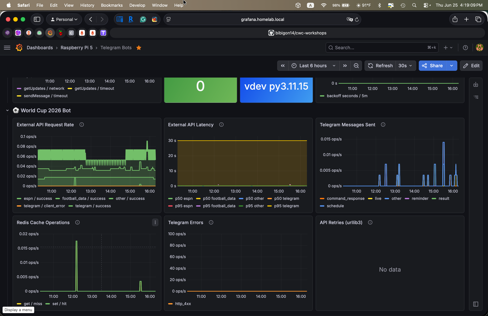

## Setup

1. Enable the textfile collector on `node_exporter`:

   ```
   ARGS="--collector.textfile.directory=/var/lib/prometheus/node-exporter"
   ```

2. Drop the scripts from `exporters/*/` into `/usr/local/bin/`, fill in
   the environment variables at the top of each (router IP, SSH key path,
   etc — see each script's header comment), and schedule them via cron.

3. For Pi-hole, see `exporters/pihole6/README.md` — and read the
   postmortem first if you're migrating from Pi-hole v5.

4. Deploy [cAdvisor](https://github.com/google/cadvisor) (`docker run gcr.io/cadvisor/cadvisor:latest`) and add it as a Prometheus scrape target if you want container-level alerting.

5. Deploy [kube-state-metrics](https://github.com/kubernetes/kube-state-metrics) (see `homelab-k3s/charts/kube-state-metrics`) and add it as a Prometheus scrape target if you want Kubernetes-object-level alerting. If Prometheus runs outside the cluster (as it does here, on the host via systemd), expose it via NodePort rather than relying on ClusterIP.

6. Install `blackbox_exporter` as a systemd service (see `exporters/blackbox/blackbox_exporter.service` and `blackbox.yml`) if you want external HTTP/TLS probing. Add a `blackbox-homelab-https` scrape job to `prometheus.yml` using the standard blackbox `relabel_configs` pattern (target → `__param_target` → `instance`, address rewritten to the exporter's own `host:9115`).

7. If running ArgoCD, expose its built-in `argocd-metrics` Service via NodePort (same reasoning as kube-state-metrics — Prometheus is outside the cluster) and add it as a scrape target if you want GitOps sync/health alerting.

8. Copy `alerting/alerts.yml`, `alerting/cadvisor-alerts.yml`, `alerting/k3s-alerts.yml`, `alerting/blackbox-alerts.yml`, and `alerting/argocd-alerts.yml` to your Prometheus rules directory (e.g. `/etc/prometheus/rules/`), reference them in `prometheus.yml`'s `rule_files`, and reload Prometheus.

9. Import dashboards from `grafana/dashboards/` into Grafana, pointing at
   your Prometheus datasource.

## License

MIT.
